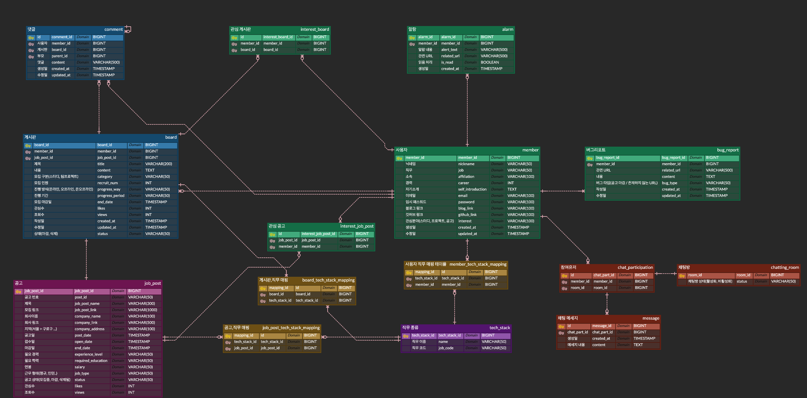
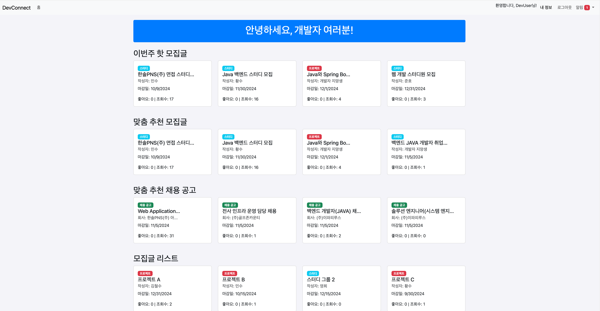
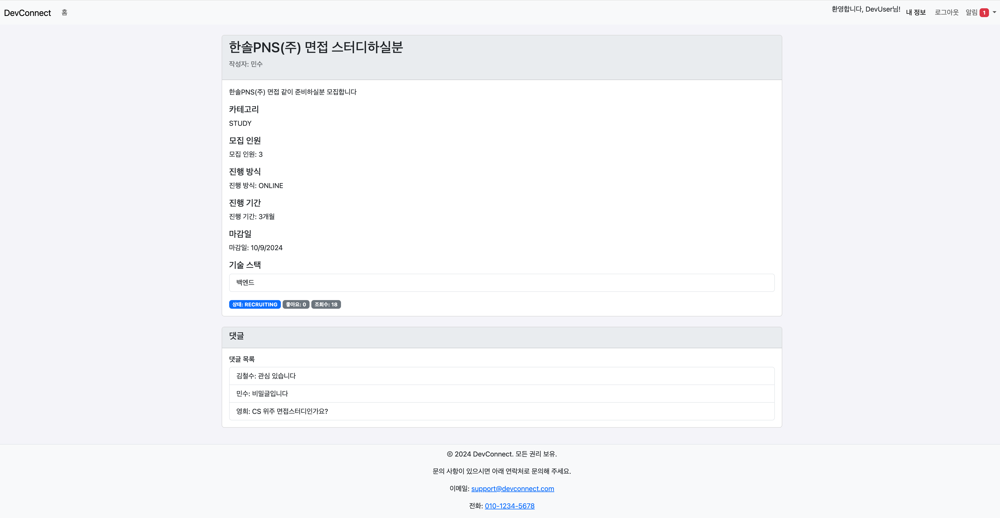

# NBE1_2_Team8

## 프로젝트 개요
본 프로젝트는 팀 스터디 및 프로젝트 모집을 위한 게시판 플랫폼입니다. 사용자는 이 플랫폼을 통해 다양한 스터디와 프로젝트에 참여할 수 있으며, 채용 정보도 API를 통해 실시간으로 제공받을 수 있습니다. 이를 통해 사용자들은 채용 정보와 관련된 스터디 및 프로젝트를 손쉽게 찾고 모집할 수 있습니다.
- **주요 기능**
  - 게시판 기능: 팀 스터디 및 프로젝트 모집을 위한 게시판을 운영하여 사용자들이 자유롭게 게시글을 작성하고 참여할 수 있습니다.
    - 채용 정보 통합 <br> 외부 API를 통해 최신 채용 정보를 자동으로 가져와 게시판 형태로 제공합니다. <> 이를 통해 사용자는 채용 공고와 관련된 스터디 및 프로젝트를 쉽게 검색하고 참여할 수 있습니다.
    - 채팅방 기능 <br> 게시판에서 모집된 스터디 및 프로젝트와 관련된 이야기를 나눌 수 있는 채팅방을 만들어 사용자 간의 소통을 원활하게 합니다.
    - 관심 목록 기능 <br> 사용자는 팀 스터디/프로젝트 게시판과 채용 공고 게시판에서 좋아요 표시를 통해 관심 있는 게시글을 목록에 추가할 수 있습니다.
    - 태그 기반 추천 시스템 <br> 사용자가 회원가입 시 관련 주제에 대한 태그를 등록하면, 메인 페이지에서 해당 태그와 관련된 게시글들을 자동으로 보여주는 기능을 제공합니다. 이를 통해 사용자 맞춤형 정보를 효과적으로 전달합니다.
- **개발 기간** :
  2024.09.23 ~ 2024.10.10
- **기능 개발** :
    - 1차 스프린트 : 기초적인 채용 공고 조회 및 모집 기능 구현
    - 2차 스프린트 : 알림 시스템과 스터디/프로젝트 관리 기능 확장
    - 3차 스프린트 : 추가적인 검색 필터링, 프로젝트 및 스터디 연계성 강화

<br></br>
<p align="left">  
    
  <h2> 팀원 </h2>
</p>

|Backend|Backend|Backend|Backend|Backend|
|:---:|:---:|:---:|:---:|:---:|
| </a> <a href="https://github.com/j-ra1n"> | </a> <a href="https://github.com/leebs0521"> | </a> <a href="https://github.com/InaJeong73"> | </a>  <a href="https://github.com/eundeang"> | </a> <a href="https://github.com/Iecorn">|
|[이정우](https://github.com/j-ra1n)|[이범수](https://github.com/leebs0521)|[정인아](https://github.com/InaJeong73)|[허은정](https://github.com/eundeang)|[윤이건](https://github.com/Iecorn)|

### 업무 분담
- 이정우 (팀장)
  - 사람인 Api 사용 개발
  - 채용공고 기능 개발
- 이범수
  - 유저 기능 개발
    - 스프링 시큐리티 + JWT 기반 인증
  - 관심 기능 개발
- 윤이건
  - 채팅 도메인 개발
  - 버그 리포트 도메인 개발
  - 사용자, 게시판 기술 스택 수정, 삭제 개발
- 허은정
  - 알림 기능 + Email 전송 기능 개발
- 정인아
  - 게시물 기능 개발
  - 댓글 기능 개발
  

## 🔨 개발 환경
- IDEA : Intellij
- 언어
    - java 17
- 프레임 워크
    - Spring boot
    - groovy gradle
- DB
    - Mysql 8
- dependency
    - JPA, Spring data JPA
    - QueryDsl
    - Spring Security + jwt (+ 레디스)
    - thymeleaf
    - Validation
    - Swagger
    - lombok
    - mysql-connector-java
    - Spring Boot DevTools
    - Spring Web
    - Mockito

## 📄 전체 기획서
[노션 페이지](https://www.notion.so/e9ed9427b11e4b108978ec51b531bdd5?pvs=4)

## 🏗️ 프로젝트 구조
<details>
  <summary>프로젝트 구조</summary>
  
```bash
    src
    ├── main
    │   ├── java
    │   │   └── org
    │   │       └── prgrms
    │   │           └── devconnect
    │   │               ├── DevconnectApplication.java
    │   │               ├── api
    │   │               │   ├── controller
    │   │               │   │   ├── alarm
    │   │               │   │   │   ├── AlarmController.java
    │   │               │   │   │   └── dto
    │   │               │   │   │       └── response
    │   │               │   │   │           ├── AlarmGetResponse.java
    │   │               │   │   │           └── AlarmsGetResponse.java
    │   │               │   │   ├── board
    │   │               │   │   │   ├── BoardController.java
    │   │               │   │   │   └── dto
    │   │               │   │   │       ├── BoardFilterDto.java
    │   │               │   │   │       ├── request
    │   │               │   │   │       │   ├── BoardCreateRequestDto.java
    │   │               │   │   │       │   ├── BoardTechStackRequestDto.java
    │   │               │   │   │       │   └── BoardUpdateRequestDto.java
    │   │               │   │   │       └── response
    │   │               │   │   │           ├── BoardInfoResponseDto.java
    │   │               │   │   │           └── BoardResponseDto.java
    │   │               │   │   ├── bugreport
    │   │               │   │   │   ├── BugReportController.java
    │   │               │   │   │   └── dto
    │   │               │   │   │       ├── request
    │   │               │   │   │       │   ├── BugReportRequest.java
    │   │               │   │   │       │   └── BugReportUpdateRequest.java
    │   │               │   │   │       └── response
    │   │               │   │   │           └── BugReportResponse.java
    │   │               │   │   ├── chatting
    │   │               │   │   │   ├── ChatWebSocketController.java
    │   │               │   │   │   ├── ChattingControllor.java
    │   │               │   │   │   └── dto
    │   │               │   │   │       ├── request
    │   │               │   │   │       │   ├── ChatRoomRequest.java
    │   │               │   │   │       │   ├── JoinRequest.java
    │   │               │   │   │       │   └── MessageRequest.java
    │   │               │   │   │       └── response
    │   │               │   │   │           ├── ChatPartResponse.java
    │   │               │   │   │           ├── ChatRoomListResponse.java
    │   │               │   │   │           ├── MessageFullResponse.java
    │   │               │   │   │           └── MessageResponse.java
    │   │               │   │   ├── comment
    │   │               │   │   │   ├── CommentController.java
    │   │               │   │   │   └── dto
    │   │               │   │   │       ├── request
    │   │               │   │   │       │   ├── CommentCreateRequestDto.java
    │   │               │   │   │       │   └── CommentUpdateRequestDto.java
    │   │               │   │   │       └── response
    │   │               │   │   │           └── CommentResponseDto.java
    │   │               │   │   ├── interest
    │   │               │   │   │   ├── InterestController.java
    │   │               │   │   │   └── dto
    │   │               │   │   │       ├── request
    │   │               │   │   │       │   ├── InterestBoardRequestDto.java
    │   │               │   │   │       │   └── InterestJobPostRequestDto.java
    │   │               │   │   │       └── response
    │   │               │   │   │           └── InterestResponseDto.java
    │   │               │   │   ├── jobpost
    │   │               │   │   │   ├── JobPostController.java
    │   │               │   │   │   └── dto
    │   │               │   │   │       └── response
    │   │               │   │   │           └── JobPostInfoResponseDto.java
    │   │               │   │   ├── member
    │   │               │   │   │   ├── MemberController.java
    │   │               │   │   │   └── dto
    │   │               │   │   │       ├── request
    │   │               │   │   │       │   ├── MemberCreateRequestDto.java
    │   │               │   │   │       │   ├── MemberLoginRequestDto.java
    │   │               │   │   │       │   └── MemberUpdateRequestDto.java
    │   │               │   │   │       └── response
    │   │               │   │   │           └── MemberResponseDto.java
    │   │               │   │   └── techstack
    │   │               │   │       ├── TechStackController.java
    │   │               │   │       └── dto
    │   │               │   │           └── response
    │   │               │   │               └── TechStackResponseDto.java
    │   │               │   └── service
    │   │               │       ├── alarm
    │   │               │       │   ├── AlarmCommandService.java
    │   │               │       │   ├── AlarmQueryService.java
    │   │               │       │   ├── EmailService.java
    │   │               │       │   └── config
    │   │               │       │       └── MailConfig.java
    │   │               │       ├── board
    │   │               │       │   ├── BoardCommandService.java
    │   │               │       │   ├── BoardQueryService.java
    │   │               │       │   └── BoardScheduleService.java
    │   │               │       ├── bugreport
    │   │               │       │   ├── BugReportCommendService.java
    │   │               │       │   └── BugReportQueryService.java
    │   │               │       ├── chatting
    │   │               │       │   ├── ChattingCommandService.java
    │   │               │       │   └── ChattingQueryService.java
    │   │               │       ├── comment
    │   │               │       │   ├── CommentCommandService.java
    │   │               │       │   └── CommentQueryService.java
    │   │               │       ├── interest
    │   │               │       │   ├── InterestCommandService.java
    │   │               │       │   └── InterestQueryService.java
    │   │               │       ├── jobpost
    │   │               │       │   ├── JobPostCommandService.java
    │   │               │       │   └── JobPostQueryService.java
    │   │               │       ├── member
    │   │               │       │   ├── MemberCommandService.java
    │   │               │       │   └── MemberQueryService.java
    │   │               │       └── techstack
    │   │               │           └── TechStackQueryService.java
    │   │               ├── common
    │   │               │   ├── auth
    │   │               │   │   ├── CustomerMemberDetailsService.java
    │   │               │   │   ├── JwtService.java
    │   │               │   │   ├── filter
    │   │               │   │   │   ├── JwtTokenAuthenticationFilter.java
    │   │               │   │   │   └── LoginAuthenticationFilter.java
    │   │               │   │   ├── handler
    │   │               │   │   │   ├── LoginFailureHandler.java
    │   │               │   │   │   └── LoginSuccessHandler.java
    │   │               │   │   └── redis
    │   │               │   │       ├── RefreshToken.java
    │   │               │   │       └── RefreshTokenRepository.java
    │   │               │   ├── config
    │   │               │   │   └── WebSocketConfig.java
    │   │               │   └── exception
    │   │               │       ├── DevConnectException.java
    │   │               │       ├── ExceptionCode.java
    │   │               │       ├── ExceptionResponse.java
    │   │               │       ├── GlobalExceptionHandler.java
    │   │               │       ├── alarm
    │   │               │       │   ├── AlarmException.java
    │   │               │       │   └── EmailException.java
    │   │               │       ├── board
    │   │               │       │   └── BoardException.java
    │   │               │       ├── bugreport
    │   │               │       │   └── BugReportException.java
    │   │               │       ├── chatting
    │   │               │       │   └── ChattingException.java
    │   │               │       ├── comment
    │   │               │       │   └── CommentException.java
    │   │               │       ├── interest
    │   │               │       │   └── InterestException.java
    │   │               │       ├── jobpost
    │   │               │       │   └── JobPostException.java
    │   │               │       ├── member
    │   │               │       │   └── MemberException.java
    │   │               │       ├── refresh
    │   │               │       │   └── RefreshTokenException.java
    │   │               │       └── techstack
    │   │               │           └── TechStackException.java
    │   │               ├── domain
    │   │               │   ├── config
    │   │               │   │   ├── QueryDslConfig.java
    │   │               │   │   ├── RedisConfig.java
    │   │               │   │   ├── SecurityConfig.java
    │   │               │   │   └── SwaggerConfig.java
    │   │               │   └── define
    │   │               │       ├── CreateTimestamp.java
    │   │               │       ├── Timestamp.java
    │   │               │       ├── alarm
    │   │               │       │   ├── aop
    │   │               │       │   │   ├── AlarmCreater.java
    │   │               │       │   │   └── RegisterPublisher.java
    │   │               │       │   ├── entity
    │   │               │       │   │   └── Alarm.java
    │   │               │       │   ├── event
    │   │               │       │   │   ├── EventHandler.java
    │   │               │       │   │   ├── RegisteredCommentOnBoardEvent.java
    │   │               │       │   │   ├── RegisteredReceivedMessageEvent.java
    │   │               │       │   │   ├── RegisteredReplyCommentEvent.java
    │   │               │       │   │   ├── RegisteredUrgentEvent.java
    │   │               │       │   │   └── RegisteredWelcomeEvent.java
    │   │               │       │   └── repository
    │   │               │       │       └── AlarmRepository.java
    │   │               │       ├── board
    │   │               │       │   ├── entity
    │   │               │       │   │   ├── Board.java
    │   │               │       │   │   ├── BoardTechStackMapping.java
    │   │               │       │   │   ├── Comment.java
    │   │               │       │   │   └── constant
    │   │               │       │   │       ├── BoardCategory.java
    │   │               │       │   │       ├── BoardStatus.java
    │   │               │       │   │       └── ProgressWay.java
    │   │               │       │   └── repository
    │   │               │       │       ├── BoardRepository.java
    │   │               │       │       ├── BoardTechStackMappingRepository.java
    │   │               │       │       ├── CommentRepository.java
    │   │               │       │       └── custom
    │   │               │       │           ├── BoardRepositoryCustom.java
    │   │               │       │           └── BoardRepositoryCustomImpl.java
    │   │               │       ├── bugreport
    │   │               │       │   ├── entity
    │   │               │       │   │   ├── BugReport.java
    │   │               │       │   │   └── constant
    │   │               │       │   │       └── BugType.java
    │   │               │       │   └── repository
    │   │               │       │       └── BugReportRepository.java
    │   │               │       ├── chatting
    │   │               │       │   ├── entity
    │   │               │       │   │   ├── ChatParticipation.java
    │   │               │       │   │   ├── ChattingRoom.java
    │   │               │       │   │   ├── Message.java
    │   │               │       │   │   └── constant
    │   │               │       │   │       └── ChattingRoomStatus.java
    │   │               │       │   └── repository
    │   │               │       │       ├── ChatParticipationRepository.java
    │   │               │       │       ├── ChattingRoomRepository.java
    │   │               │       │       ├── MessageRepository.java
    │   │               │       │       └── custom
    │   │               │       │           ├── ChatPartRepositoryCustom.java
    │   │               │       │           └── ChatPartRepositoryCustomImpl.java
    │   │               │       ├── interest
    │   │               │       │   ├── entity
    │   │               │       │   │   ├── InterestBoard.java
    │   │               │       │   │   └── InterestJobPost.java
    │   │               │       │   └── repository
    │   │               │       │       ├── InterestBoardRepository.java
    │   │               │       │       └── InterestJobPostRepository.java
    │   │               │       ├── jobpost
    │   │               │       │   ├── entity
    │   │               │       │   │   ├── JobPost.java
    │   │               │       │   │   ├── JobPostTechStackMapping.java
    │   │               │       │   │   └── constant
    │   │               │       │   │       ├── JobType.java
    │   │               │       │   │       └── Status.java
    │   │               │       │   └── repository
    │   │               │       │       ├── JobPostRepository.java
    │   │               │       │       ├── JobPostTechStackRepository.java
    │   │               │       │       └── custom
    │   │               │       │           ├── JobPostRepositoryCustom.java
    │   │               │       │           └── JobPostRepositoryImpl.java
    │   │               │       ├── member
    │   │               │       │   ├── entity
    │   │               │       │   │   ├── Member.java
    │   │               │       │   │   ├── MemberTechStackMapping.java
    │   │               │       │   │   └── constant
    │   │               │       │   │       └── Interest.java
    │   │               │       │   └── repository
    │   │               │       │       ├── MemberRepository.java
    │   │               │       │       ├── MemberTechStackMappingRepository.java
    │   │               │       │       └── custom
    │   │               │       │           ├── MemberRepositoryCustom.java
    │   │               │       │           └── MemberRepositoryCustomImpl.java
    │   │               │       └── techstack
    │   │               │           ├── entity
    │   │               │           │   └── TechStack.java
    │   │               │           └── repository
    │   │               │               └── TechStackRepository.java
    │   │               ├── external
    │   │               │   └── saramin
    │   │               │       ├── JobPostApi.java
    │   │               │       ├── JobPostRunner.java
    │   │               │       ├── JobPostScheduledRunner.java
    │   │               │       └── dto
    │   │               │           └── response
    │   │               │               ├── CompanyHtmlResponse.java
    │   │               │               ├── CompanyXmlResponse.java
    │   │               │               ├── JobSearchResponse.java
    │   │               │               ├── JobXmlResponse.java
    │   │               │               ├── JobsXmlResponse.java
    │   │               │               └── PositionXmlResponse.java
    │   │               └── view
    │   │                   ├── ChatTestController.java
    │   │                   └── ViewController.java
    │   └── resources
    │       ├── application.yaml
    │       └── templates
    │           ├── SimpleChatTest.html
    │           ├── board-detail.html
    │           ├── emailForm.html
    │           ├── index.html
    │           ├── job-detail.html
    │           └── login.html
    └── test
        ├── java
        │   └── org
        │       └── prgrms
        │           └── devconnect
        │               ├── DevconnectApplicationTests.java
        │               ├── api
        │               │   └── service
        │               │       ├── alarm
        │               │       │   ├── AlarmCommandServiceTest.java
        │               │       │   └── AlarmQueryServiceTest.java
        │               │       ├── board
        │               │       │   ├── BoardCommandServiceTest.java
        │               │       │   ├── BoardQueryServiceTest.java
        │               │       │   └── BoardScheduleServiceTest.java
        │               │       ├── bugreport
        │               │       │   ├── BugReportCommendServiceTest.java
        │               │       │   └── BugReportQueryServiceTest.java
        │               │       ├── chatting
        │               │       │   ├── ChattingCommendServiceTest.java
        │               │       │   └── ChattingQueryServiceTest.java
        │               │       ├── comment
        │               │       │   ├── CommentCommandServiceTest.java
        │               │       │   └── CommentQueryServiceTest.java
        │               │       ├── interest
        │               │       │   ├── InterestCommandServiceTest.java
        │               │       │   └── InterestQueryServiceTest.java
        │               │       ├── member
        │               │       │   ├── MemberCommandServiceTest.java
        │               │       │   └── MemberQueryServiceTest.java
        │               │       └── techstack
        │               │           └── TechStackQueryServiceTest.java
        │               └── domain
        │                   └── define
        │                       ├── chatting
        │                       │   └── entity
        │                       │       └── ChattingRoomTest.java
        │                       └── fixture
        │                           ├── BoardFixture.java
        │                           ├── BugReportFixture.java
        │                           ├── CommentFixture.java
        │                           ├── InterestFixture.java
        │                           ├── JobPostFixture.java
        │                           ├── MemberFixture.java
        │                           └── TechStackFixture.java
        └── resources
            └── application-test.yaml

 ```
</details>


## 💽ERD
<center>

</center>
<details>
  <summary> DDL </summary>

```sql

CREATE TABLE board
(
  board_id        BIGINT       NOT NULL AUTO_INCREMENT,
  member_id       BIGINT       NOT NULL,
  job_post_id     BIGINT       NULL,
  title           VARCHAR(200) NULL,
  content         TEXT         NULL,
  category        VARCHAR(50)  NULL,
  recruit_num     INT          NULL,
  progress_way    VARCHAR(50)  NULL,
  progress_period VARCHAR(50)  NULL,
  end_date        TIMESTAMP    NULL,
  likes           INT          NULL,
  views           INT          NULL,
  created_at      TIMESTAMP    NULL,
  updated_at      TIMESTAMP    NULL,
  status          VARCHAR(50)  NULL,
  PRIMARY KEY (board_id)
);

CREATE TABLE member
(
  member_id         BIGINT       NOT NULL AUTO_INCREMENT,
  nickname          VARCHAR(50)  NULL,
  job               VARCHAR(50)  NULL,
  affiliation       VARCHAR(100) NULL,
  career            INT          NULL,
  self_introduction TEXT         NULL,
  email             VARCHAR(100) NULL,
  password          VARCHAR(100) NULL,
  blog_link         VARCHAR(100) NULL,
  github_link       VARCHAR(100) NULL,
  interest          VARCHAR(100) NULL,
  created_at        TIMESTAMP    NULL,
  updated_at        TIMESTAMP    NULL,
  PRIMARY KEY (member_id)
);

CREATE TABLE interest_board
(
  interest_board_id BIGINT NOT NULL AUTO_INCREMENT,
  member_id         BIGINT NOT NULL,
  board_id          BIGINT NOT NULL,
  PRIMARY KEY (interest_board_id)
);

CREATE TABLE comment
(
  comment_id BIGINT       NOT NULL AUTO_INCREMENT,
  member_id  BIGINT       NOT NULL,
  board_id   BIGINT       NOT NULL,
  parent_id  BIGINT       NULL,
  content    VARCHAR(500) NULL,
  created_at TIMESTAMP    NULL,
  updated_at TIMESTAMP    NULL,
  PRIMARY KEY (comment_id)
);

CREATE TABLE alarm
(
  alarm_id    BIGINT       NOT NULL AUTO_INCREMENT,
  member_id   BIGINT       NOT NULL,
  alert_text  VARCHAR(500) NULL,
  related_url VARCHAR(500) NULL,
  is_read     BOOLEAN      NULL,
  created_at  TIMESTAMP    NULL,
  PRIMARY KEY (alarm_id)
);

CREATE TABLE job_post
(
  job_post_id        BIGINT        NOT NULL AUTO_INCREMENT,
  post_id            BIGINT,
  job_post_name      VARCHAR(300)  NULL,
  job_post_link      VARCHAR(1000) NULL,
  company_name       VARCHAR(100)  NULL,
  company_link       VARCHAR(500)  NULL,
  company_address    VARCHAR(100)  NULL,
  post_date          TIMESTAMP     NULL,
  open_date          TIMESTAMP     NULL,
  end_date           TIMESTAMP     NULL,
  experience_level   VARCHAR(50)   NULL,
  required_education VARCHAR(50)   NULL,
  salary             VARCHAR(50)   NULL,
  job_type           VARCHAR(50)   NULL,
  status             VARCHAR(50)   NULL,
  likes              INT           NULL,
  views              INT           NULL,
  PRIMARY KEY (job_post_id)
);

CREATE TABLE tech_stack
(
  tech_stack_id BIGINT      NOT NULL AUTO_INCREMENT,
  name          VARCHAR(50) NULL,
  job_code      VARCHAR(50) NULL,
  PRIMARY KEY (tech_stack_id)
);

CREATE TABLE job_post_tech_stack_mapping
(
  id            BIGINT NOT NULL AUTO_INCREMENT,
  tech_stack_id BIGINT NOT NULL,
  job_post_id   BIGINT NOT NULL,
  PRIMARY KEY (id)
);

CREATE TABLE bug_report
(
  bug_report_id BIGINT       NOT NULL AUTO_INCREMENT,
  member_id     BIGINT       NOT NULL,
  related_url   VARCHAR(500) NULL,
  content       TEXT         NULL,
  bug_type      VARCHAR(50)  NULL,
  created_at    TIMESTAMP    NULL,
  updated_at    TIMESTAMP    NULL,
  PRIMARY KEY (bug_report_id)
);

CREATE TABLE board_tech_stack_mapping
(
  id            BIGINT NOT NULL AUTO_INCREMENT,
  board_id      BIGINT NOT NULL,
  tech_stack_id BIGINT NOT NULL,
  PRIMARY KEY (id)
);

CREATE TABLE member_tech_stack_mapping
(
  id            BIGINT NOT NULL AUTO_INCREMENT,
  tech_stack_id BIGINT NOT NULL,
  member_id     BIGINT NOT NULL,
  PRIMARY KEY (id)
);

CREATE TABLE interest_job_post
(
  interest_job_post_id BIGINT NOT NULL AUTO_INCREMENT,
  job_post_id          BIGINT NOT NULL,
  member_id            BIGINT NOT NULL,
  PRIMARY KEY (interest_job_post_id)
);

CREATE TABLE chatting_room
(
  room_id BIGINT      NOT NULL AUTO_INCREMENT,
  status  VARCHAR(50) NULL,
  PRIMARY KEY (room_id)
);

CREATE TABLE chat_participation
(
  chat_part_id BIGINT NOT NULL AUTO_INCREMENT,
  member_id    BIGINT NOT NULL,
  room_id      BIGINT NOT NULL,
  PRIMARY KEY (chat_part_id)
);


CREATE TABLE message
(
  message_id   BIGINT    NOT NULL AUTO_INCREMENT,
  chat_part_id BIGINT    NOT NULL,
  created_at   TIMESTAMP NULL,
  content      TEXT      NULL,
  PRIMARY KEY (message_id)
);

-- 외래키 제약조건 (채팅 관련 외래키 제약 조건들은 테스트후 삭제 예정)
-- 외래키에 ON DELETE CASCADE 추가
ALTER TABLE interest_board
  ADD FOREIGN KEY (member_id) REFERENCES member(member_id) ON DELETE CASCADE,
  ADD FOREIGN KEY (board_id) REFERENCES board(board_id) ON DELETE CASCADE;

ALTER TABLE comment
  ADD FOREIGN KEY (member_id) REFERENCES member(member_id) ON DELETE CASCADE,
  ADD FOREIGN KEY (board_id) REFERENCES board(board_id) ON DELETE CASCADE,
  ADD FOREIGN KEY (parent_id) REFERENCES comment(comment_id) ON DELETE CASCADE;

ALTER TABLE alarm
  ADD FOREIGN KEY (member_id) REFERENCES member(member_id) ON DELETE CASCADE;

ALTER TABLE job_post_tech_stack_mapping
  ADD FOREIGN KEY (tech_stack_id) REFERENCES tech_stack(tech_stack_id) ON DELETE CASCADE,
  ADD FOREIGN KEY (job_post_id) REFERENCES job_post(job_post_id) ON DELETE CASCADE;

ALTER TABLE bug_report
  ADD FOREIGN KEY (member_id) REFERENCES member(member_id) ON DELETE CASCADE;

ALTER TABLE board_tech_stack_mapping
  ADD FOREIGN KEY (board_id) REFERENCES board(board_id) ON DELETE CASCADE,
  ADD FOREIGN KEY (tech_stack_id) REFERENCES tech_stack(tech_stack_id) ON DELETE CASCADE;

ALTER TABLE member_tech_stack_mapping
  ADD FOREIGN KEY (tech_stack_id) REFERENCES tech_stack(tech_stack_id) ON DELETE CASCADE,
  ADD FOREIGN KEY (member_id) REFERENCES member(member_id) ON DELETE CASCADE;

ALTER TABLE interest_job_post
  ADD FOREIGN KEY (job_post_id) REFERENCES job_post(job_post_id) ON DELETE CASCADE,
  ADD FOREIGN KEY (member_id) REFERENCES member(member_id) ON DELETE CASCADE;

ALTER TABLE chat_participation
  ADD FOREIGN KEY (member_id) REFERENCES member(member_id) ON DELETE CASCADE,
  ADD FOREIGN KEY (room_id) REFERENCES chatting_room(room_id) ON DELETE CASCADE;

ALTER TABLE message
  ADD FOREIGN KEY (chat_part_id) REFERENCES chat_participation(chat_part_id) ON DELETE CASCADE;

ALTER TABLE board
  ADD FOREIGN KEY (member_id) REFERENCES  member (member_id) ON DELETE CASCADE,
  ADD FOREIGN KEY (job_post_id) REFERENCES  job_post (job_post_id);

-- message 테이블의 created_at에 내림차순 인덱스 적용 or message id 생성 방식 변경후 내림차순 인덱스 적용
CREATE INDEX idx_message_created_at_desc ON message (created_at DESC);


 ```
</details>

## ✏️ 요구사항 정의서
[요구사항 정의서](doc/srs-chart.md)

## 📄 API 문서
[API 문서](doc/api-doc.md)

## 🖥️ 화면 예시
<center>

</center>
<center>

</center>
<center>

</center>


## 💬 Branch, 커밋 메시지, PR 규칙
**Branch**
```
• master : 배포가 가능한 가장 메인이 되는 브랜치
• hotfix : 빠르게 버그를 수정해야 할 때 사용하는 브랜치
• release : 프로젝트 배포를 준비하기 위해 사용하는 브랜치
• develop : 개발 과정에서 사용하는 중심 브랜치
    • feat : 각 기능을 구현할 때 사용하는 브랜치
```
**커밋 메시지**
<br>
• Commit Type ✏️

| Type     | 설명                                                                 |
|----------|----------------------------------------------------------------------|
| init     | 프로젝트 초기 생성                                                   |
| fix      | 버그 수정 또는 typo                                                  |
| feat     | 새로운 기능 추가                                                     |
| rename   | 파일 혹은 폴더명 수정하거나 옮기는 경우                              |
| remove   | 파일을 삭제하는 작업만 수행하는 경우                                 |
| refactor | 리팩토링                                                             |
| comment  | 필요한 주석 추가 및 변경                                             |
| test     | 테스트(테스트 코드 추가, 수정, 삭제, 비즈니스 로직에 변경이 없는 경우) |
| style    | 코드 포맷팅, 세미콜론 누락, 코드 변경이 없는 경우                    |
| chore    | 위에 걸리지 않는 기타 변경사항(빌드 스크립트 수정, assets image, 패키지 매니저 등) |
| design   | CSS 등 사용자 UI 디자인 변경                                          |
| docs     | 이슈템플릿이나 리드미와 같은 서비스에는 영향이 없지만 편의를 위해 작성하는 파일을 관리하는 경우 |

• Subject Rule 🐭
```
1. 제목은 최대 50글자 넘지 않기
2. 마침표 및 특수기호 사용x
3. 첫 글자 대문자, 명령문 사용
4. 개조식 구문으로 작성(간결하고 요점적인 서술)
```