## 사용자

### **1. 회원 가입 (User-01)**

- **기능 설명**: 사용자가 기본 정보를 입력하여 회원 가입을 진행합니다.
- **API 명세서**: `POST /api/v1/members/signup`
- **시퀀스 흐름**:
    1. 사용자가 기본 정보를 입력하여 회원가입 요청을 보냅니다.
    2. 서버는 입력된 데이터를 검증하고, 검증에 성공하면 사용자 정보를 데이터베이스에 저장합니다.
    3. 서버는 JWT를 생성하여 사용자에게 응답으로 제공합니다.

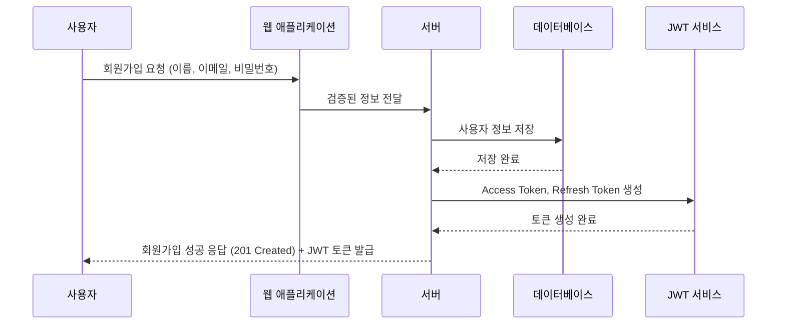

### **2. 로그인 (User-02)**

- **기능 설명**: 사용자가 이메일과 비밀번호로 로그인을 시도합니다.
- **API 명세서**: `POST /api/v1/members/login`
- **시퀀스 흐름**:
    1. 사용자가 이메일과 비밀번호로 로그인 요청을 보냅니다.
    2. 서버는 사용자 정보를 검증하고, 인증에 성공하면 JWT를 생성하여 응답으로 제공합니다.

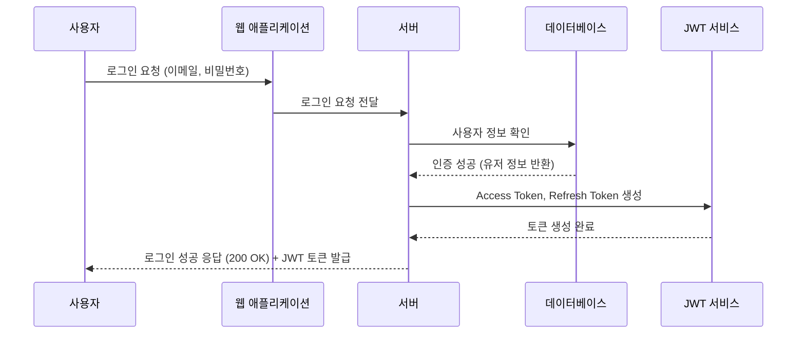

### **3. 회원 정보 수정 (User-03)**

- **기능 설명**: 사용자가 자신의 회원 정보를 수정합니다.
- **API 명세서**: `PUT /api/v1/members`
- **시퀀스 흐름**:
    1. 사용자가 수정할 회원 정보를 입력하여 요청합니다 (JWT 포함).
    2. 서버는 JWT 토큰을 검증한 후, 사용자의 정보를 데이터베이스에서 업데이트합니다.

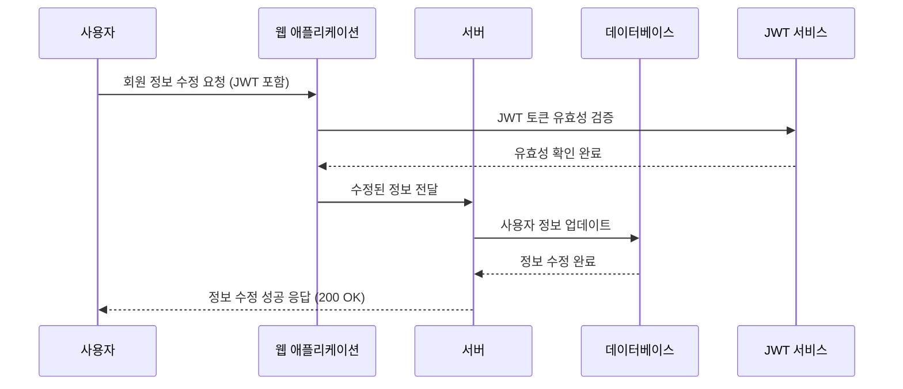

### **4. 작성글 조회 (User-04)**

- **기능 설명**: 사용자가 작성한 게시글을 조회합니다.
- **API 명세서**: `GET /api/v1/posts`
- **시퀀스 흐름**:
    1. 사용자가 게시글을 조회합니다.
    2. 서버는 데이터베이스에서 게시글 정보를 불러와 사용자에게 제공합니다.

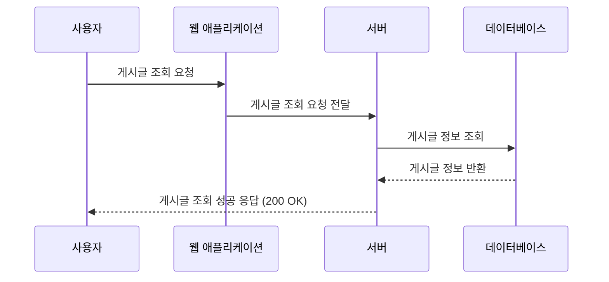

### **5. 사용자 정보 조회 (User-05)**

- **기능 설명**: 사용자가 자신의 정보를 조회합니다.
- **API 명세서**: `GET /api/v1/members`
- **시퀀스 흐름**:
    1. 사용자가 자신의 정보를 조회하는 요청을 보냅니다 (JWT 포함).
    2. 서버는 JWT 토큰을 검증한 후, 사용자 정보를 데이터베이스에서 불러와 반환합니다.

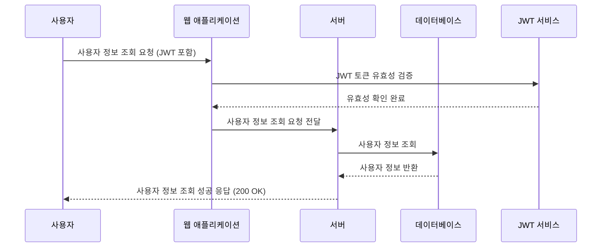

## 게시판

---

### **1. 모집글 작성 (Board-01)**

- **기능 설명**: 사용자가 프로젝트나 스터디의 모집 글을 작성합니다.
- **API 명세서**: `POST /api/v1/boards`
- **시퀀스 흐름**:
    1. 사용자가 JWT 토큰을 포함한 모집글 작성 요청을 보냅니다.
    2. 서버는 JWT 토큰을 검증하고, 인증이 성공하면 요청된 내용을 검증합니다.
    3. 검증된 내용이 데이터베이스에 저장됩니다.
    4. 성공적으로 저장되면 서버는 작성 완료 응답을 반환합니다.

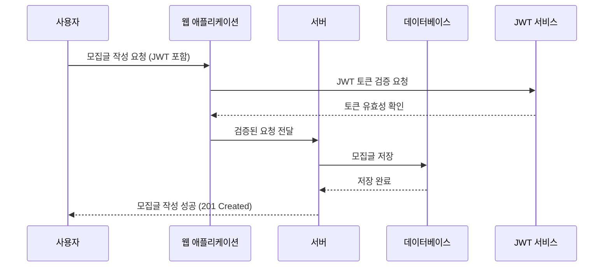

### **2. 모집글 수정 (Board-02)**

- **기능 설명**: 사용자가 작성한 모집 글을 수정합니다.
- **API 명세서**: `PUT /api/v1/boards/{id}`
- **시퀀스 흐름**:
    1. 사용자가 JWT 토큰을 포함하여 모집글 수정 요청을 보냅니다.
    2. 서버는 JWT 토큰을 검증하고, 인증이 성공하면 요청된 내용을 검증합니다.
    3. 검증된 내용이 데이터베이스에서 수정됩니다.
    4. 수정이 완료되면 서버는 수정 완료 응답을 반환합니다.

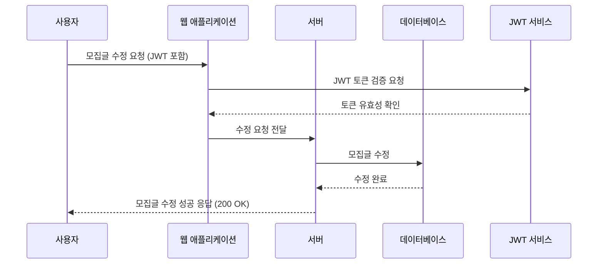

### **3. 모집글 삭제 (Board-03)**

- **기능 설명**: 사용자가 작성한 모집 글을 삭제합니다.
- **API 명세서**: `DELETE /api/v1/boards/{id}`
- **시퀀스 흐름**:
    1. 사용자가 JWT 토큰을 포함하여 모집 글 삭제 요청을 보냅니다.
    2. 서버는 JWT 토큰을 검증하고, 인증이 성공하면 데이터베이스에서 해당 모집 글을 삭제합니다.
    3. 삭제가 완료되면 서버는 삭제 완료 응답을 반환합니다.

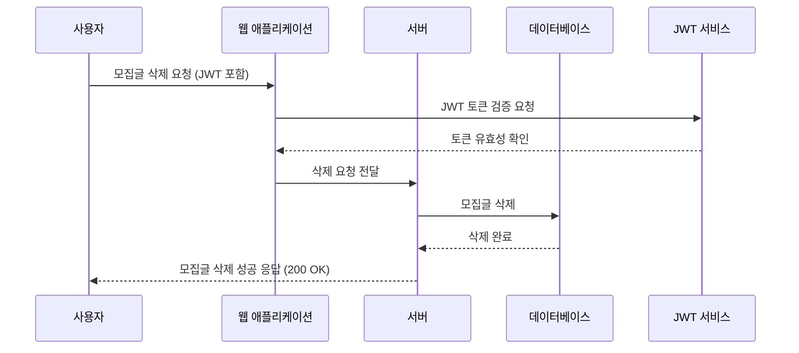

### **4. 모집글 수동 마감 (Board-04)**

- **기능 설명**: 사용자가 직접 자신이 작성한 모집글을 수동으로 마감합니다.
- **API 명세서**: `PATCH /api/v1/boards/{id}/close`
- **시퀀스 흐름**:
    1. 사용자가 JWT 토큰을 포함하여 모집글 마감 요청을 보냅니다.
    2. 서버는 JWT 토큰을 검증하고, 인증이 성공하면 해당 모집글의 상태를 '마감'으로 변경합니다.
    3. 데이터베이스에서 모집글 상태가 '마감'으로 저장됩니다.
    4. 마감이 완료되면 서버는 마감 완료 응답을 반환합니다.

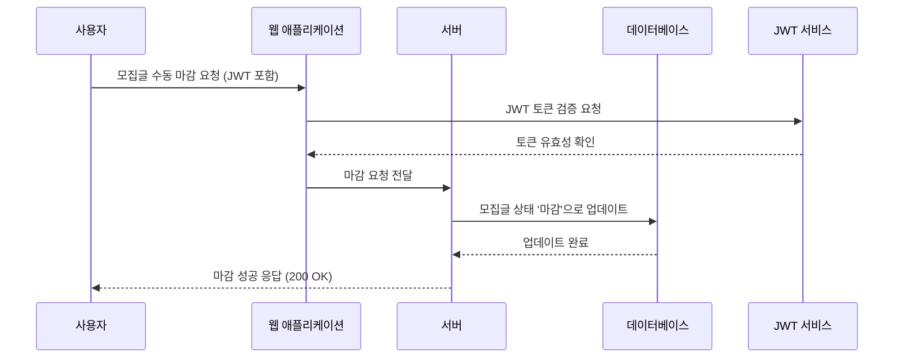

### **5. 모집글 자동 마감 (Board-05)**

- **기능 설명**: 설정된 조건에 따라 모집 마감일이 지나면 모집글이 자동으로 마감됩니다.
- **API 명세서**: `PATCH /api/v1/boards/auto-close`
- **시퀀스 흐름**:
    1. 시스템에서 마감 조건을 만족하는 모집글을 조회합니다.
    2. 해당 모집글의 상태를 '마감'으로 변경하고 데이터베이스에 업데이트합니다.
    3. 일정 주기로 시스템이 자동으로 해당 작업을 수행합니다.

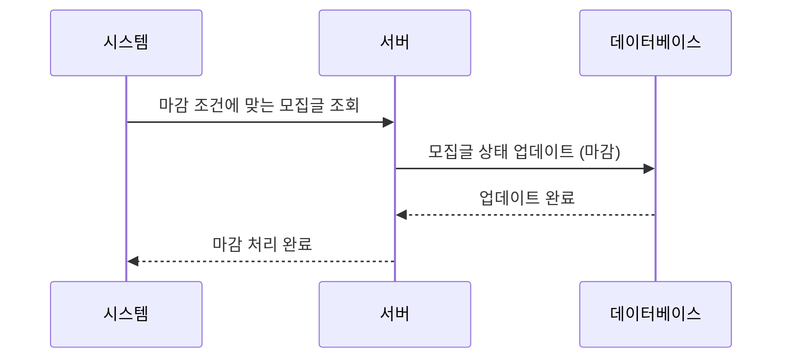

### **6. 전체 게시글 조회 (Board-06)**

- **기능 설명**: 모든 게시글을 조회합니다.
- **API 명세서**: `GET /api/v1/boards`
- **시퀀스 흐름**:
    1. 사용자가 전체 게시글 조회 요청을 보냅니다.
    2. 서버는 데이터베이스에서 모든 게시글을 조회하여 반환합니다.

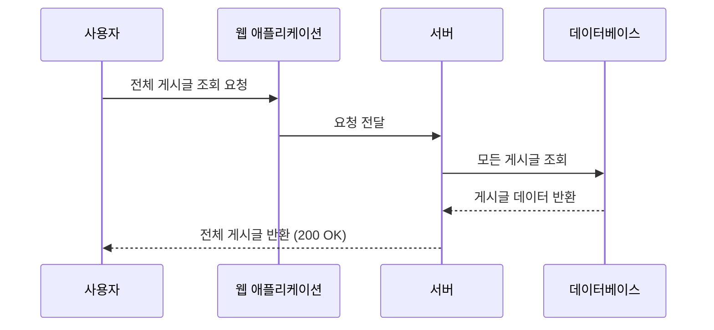

### **7. 이번 주 인기글 조회 (Board-07)**

- **기능 설명**: 이번 주 인기글을 최대 10개까지 조회합니다.
- **API 명세서**: `GET /api/v1/boards/popular`
- **시퀀스 흐름**:
    1. 사용자가 이번 주 인기 게시글 조회 요청을 보냅니다.
    2. 서버는 인기 기준에 따라 데이터베이스에서 최대 10개의 게시글을 조회하여 반환합니다.

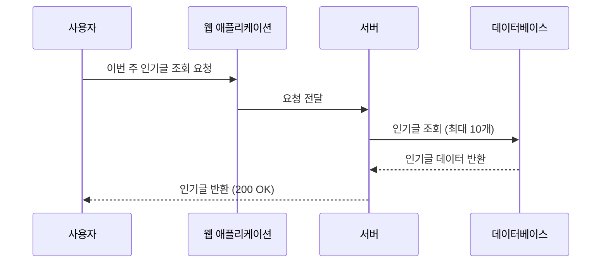

### **8. 사용자 관심분야 기준 조회 (Board-08)**

- **기능 설명**: 사용자가 설정한 관심분야를 기준으로 게시글을 조회합니다.
- **API 명세서**: `GET /api/v1/boards/interests`
- **시퀀스 흐름**:
    1. 사용자가 JWT 토큰을 포함하여 관심분야 게시글 조회 요청을 보냅니다.
    2. 서버는 JWT 토큰을 검증하고, 인증이 성공하면 데이터베이스에서 사용자의 관심분야에 맞는 게시글을 조회하여 반환합니다.

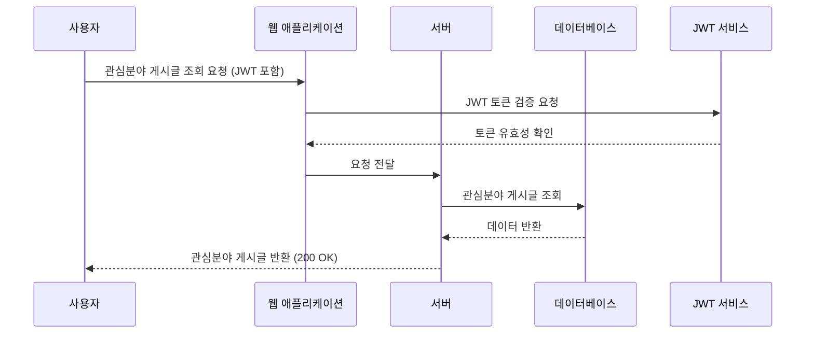

### **9. 필터링 조회 (Board-09)**

- **기능 설명**: 특정 조건에 맞춰 게시글을 필터링하여 조회합니다.
- **API 명세서**: `GET /api/v1/boards/filter`
- **시퀀스 흐름**:
    1. 사용자가 필터 조건을 포함하여 게시글 조회 요청을 보냅니다.
    2. 서버는 해당 조건에 맞는 게시글을 데이터베이스에서 조회하여 반환합니다.

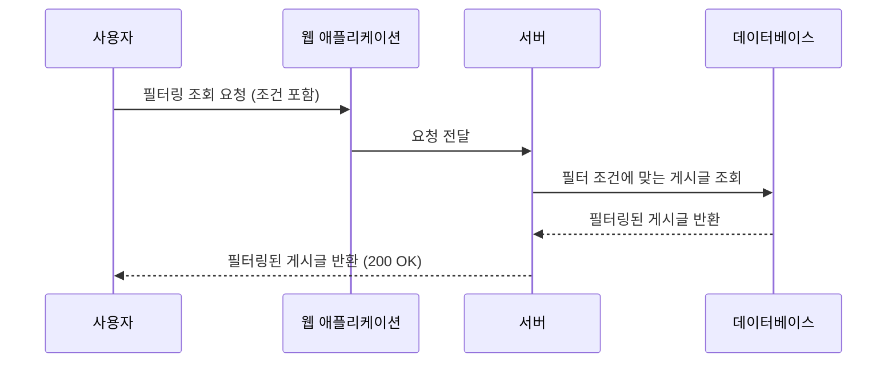

### **10. 특정 게시글 조회 (Board-10)**

- **기능 설명**: 특정 ID에 해당하는 게시글을 조회합니다.
- **API 명세서**: `GET /api/v1/boards/{id}`
- **시퀀스 흐름**:
    1. 사용자가 특정 게시글 ID를 포함하여 조회 요청을 보냅니다.
    2. 서버는 데이터베이스에서 해당 게시글을 조회하여 반환합니다.

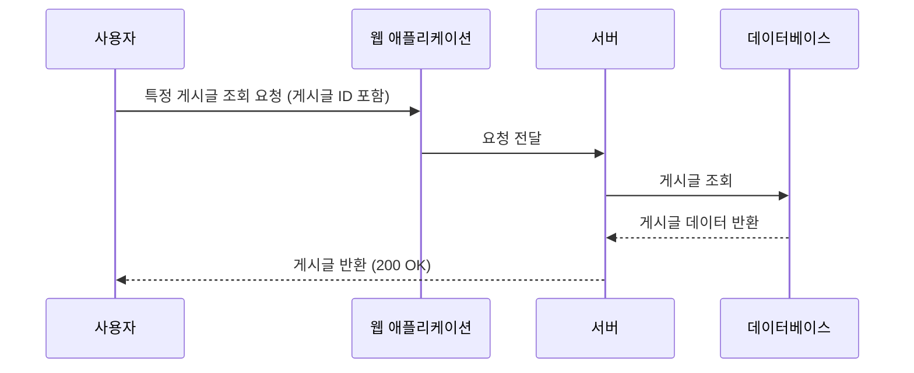

### **11. 인기 태그 생성 (Board-11)**

- **기능 설명**: 이번 주에 작성된 게시글 중 조회수가 500 이상인 게시글에 대해 '인기 태그'를 생성합니다.
- **API 명세서**: `POST /api/v1/boards/tags/popular`
- **시퀀스 흐름**:
    1. 시스템이 일정 주기로 게시글 중 조회수가 500 이상인 게시글을 조회합니다.
    2. 해당 게시글에 '인기 태그'를 생성하여 부여합니다.
    3. 태그 생성 작업이 완료되면 프론트엔드에 적용되어 표시됩니다.

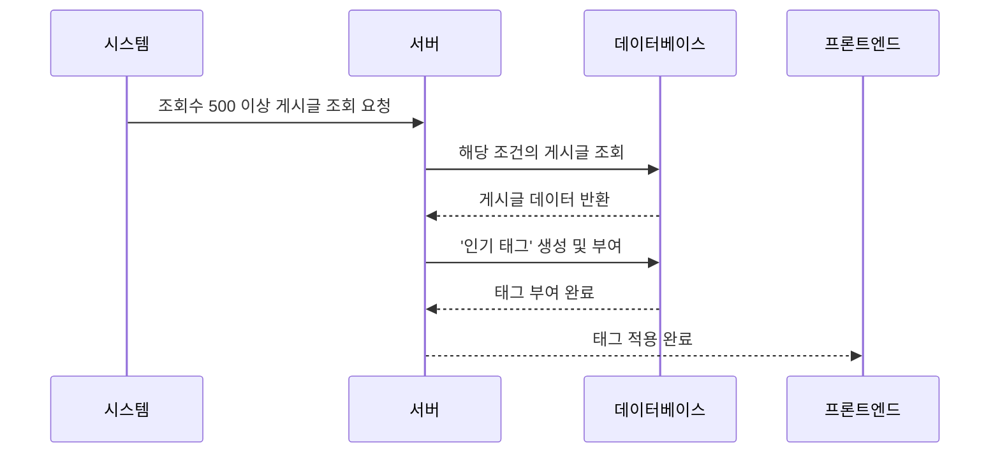

### **12. 마감글 및 태그 생성 (Board-12)**

- **기능 설명**: 마감된 게시글에 '마감 태그'를 부여하고, 마감된 지 2일이 지난 게시글에 추가적으로 태그를 생성합니다.
- **API 명세서**: `POST /api/v1/boards/tags/closed`
- **시퀀스 흐름**:
    1. 시스템이 마감된 게시글을 조회합니다.
    2. 마감된 게시글에 '마감 태그'를 생성하여 부여합니다.
    3. 마감된 지 2일이 지난 게시글에도 추가적인 태그를 생성하여 부여합니다.
    4. 태그 생성 작업이 완료되면 프론트엔드에 적용되어 표시됩니다.

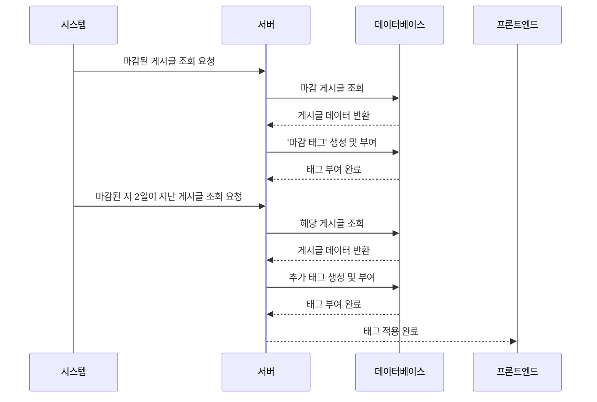

## 알람

---

### **1. 알림 생성 (Alarm-01)**

- **기능 설명**: 특정 이벤트 발생 시 사용자를 대상으로 알림을 생성합니다.
- **API 명세서**: `POST /api/v1/alarms`
- **시퀀스 흐름**:
    1. 특정 이벤트 발생 시 서버는 사용자를 대상으로 알림을 생성합니다.
    2. 생성된 알림은 데이터베이스에 저장되며, 관련된 URL 정보가 포함됩니다.
    3. 알림 생성 후, 서버는 사용자에게 알림 생성 완료를 알립니다.

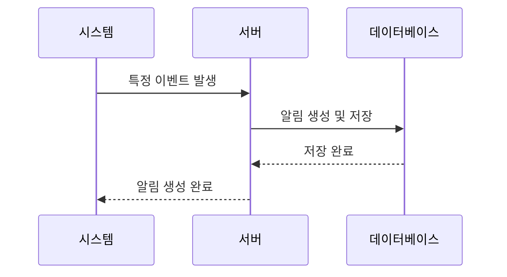

### **2. 알림 읽음 처리 (Alarm-02)**

- **기능 설명**: 사용자가 받은 알림을 읽음 처리합니다.
- **API 명세서**: `PATCH /api/v1/alarms/read`
- **시퀀스 흐름**:
    1. 사용자가 JWT 토큰을 포함하여 알림 읽음 처리 요청을 보냅니다.
    2. 서버는 JWT 토큰을 검증한 후, 사용자의 알림을 읽음 처리합니다.
    3. 데이터베이스에서 해당 알림의 상태가 '읽음'으로 업데이트됩니다.
    4. 서버는 사용자에게 알림 읽음 처리 완료 응답을 반환합니다.

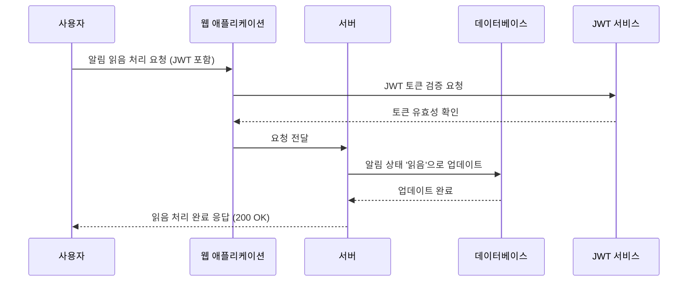

### **3. 읽지 않은 알림 수 조회 (Alarm-03)**

- **기능 설명**: 사용자가 읽지 않은 알림의 개수를 조회합니다.
- **API 명세서**: `GET /api/v1/alarms/unread-count`
- **시퀀스 흐름**:
    1. 사용자가 JWT 토큰을 포함하여 읽지 않은 알림 수 조회 요청을 보냅니다.
    2. 서버는 JWT 토큰을 검증한 후, 데이터베이스에서 사용자가 읽지 않은 알림의 수를 조회합니다.
    3. 서버는 사용자에게 읽지 않은 알림 개수를 반환합니다.

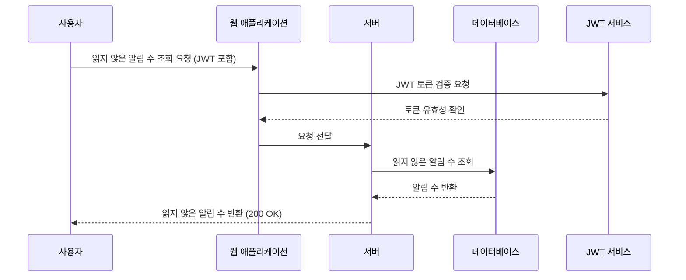

### **4. 알림 조회 (Alarm-04)**

- **기능 설명**: 사용자가 받은 모든 알림을 조회합니다.
- **API 명세서**: `GET /api/v1/alarms`
- **시퀀스 흐름**:
    1. 사용자가 JWT 토큰을 포함하여 알림 조회 요청을 보냅니다.
    2. 서버는 JWT 토큰을 검증한 후, 데이터베이스에서 사용자의 모든 알림을 조회합니다.
    3. 서버는 사용자에게 모든 알림을 반환합니다.

```mermaid
sequenceDiagram
    participant User as 사용자
    participant WebApp as 웹 애플리케이션
    participant Server as 서버
    participant DB as 데이터베이스
    participant JWT as JWT 서비스

    User->>WebApp: 알림 조회 요청 (JWT 포함)
    WebApp->>JWT: JWT 토큰 검증 요청
    JWT-->>WebApp: 토큰 유효성 확인
    WebApp->>Server: 요청 전달
    Server->>DB: 사용자의 모든 알림 조회
    DB-->>Server: 알림 데이터 반환
    Server-->>User: 모든 알림 반환 (200 OK)

```

### **5. 알림 단일 삭제 (Alarm-05)**

- **기능 설명**: 사용자가 특정 알림을 삭제합니다.
- **API 명세서**: `DELETE /api/v1/alarms/{id}`
- **시퀀스 흐름**:
    1. 사용자가 JWT 토큰을 포함하여 특정 알림 삭제 요청을 보냅니다.
    2. 서버는 JWT 토큰을 검증한 후, 데이터베이스에서 해당 알림을 삭제합니다.
    3. 서버는 사용자에게 알림 삭제 완료 응답을 반환합니다.

```mermaid
sequenceDiagram
    participant User as 사용자
    participant WebApp as 웹 애플리케이션
    participant Server as 서버
    participant DB as 데이터베이스
    participant JWT as JWT 서비스

    User->>WebApp: 특정 알림 삭제 요청 (JWT 포함)
    WebApp->>JWT: JWT 토큰 검증 요청
    JWT-->>WebApp: 토큰 유효성 확인
    WebApp->>Server: 요청 전달
    Server->>DB: 특정 알림 삭제
    DB-->>Server: 삭제 완료
    Server-->>User: 삭제 완료 응답 (200 OK)

```

### **6. 알림 전체 삭제 (Alarm-06)**

- **기능 설명**: 사용자가 받은 모든 알림을 삭제합니다.
- **API 명세서**: `DELETE /api/v1/alarms`
- **시퀀스 흐름**:
    1. 사용자가 JWT 토큰을 포함하여 모든 알림 삭제 요청을 보냅니다.
    2. 서버는 JWT 토큰을 검증한 후, 데이터베이스에서 사용자의 모든 알림을 삭제합니다.
    3. 서버는 사용자에게 알림 전체 삭제 완료 응답을 반환합니다.

```mermaid
sequenceDiagram
    participant User as 사용자
    participant WebApp as 웹 애플리케이션
    participant Server as 서버
    participant DB as 데이터베이스
    participant JWT as JWT 서비스

    User->>WebApp: 모든 알림 삭제 요청 (JWT 포함)
    WebApp->>JWT: JWT 토큰 검증 요청
    JWT-->>WebApp: 토큰 유효성 확인
    WebApp->>Server: 요청 전달
    Server->>DB: 모든 알림 삭제
    DB-->>Server: 삭제 완료
    Server-->>User: 전체 삭제 완료 응답 (200 OK)

```

### **7. 이메일로 알림 전송 (Alarm-07)**

- **기능 설명**: 사용자가 받은 모든 알림을 이메일로 전송합니다.
- **API 명세서**: `POST /api/v1/alarms/email`
- **시퀀스 흐름**:
    1. 사용자가 JWT 토큰을 포함하여 알림 이메일 전송 요청을 보냅니다.
    2. 서버는 JWT 토큰을 검증한 후, 사용자의 이메일로 알림 내용을 전송합니다.

```mermaid
sequenceDiagram
    participant User as 사용자
    participant WebApp as 웹 애플리케이션
    participant Server as 서버
    participant JWT as JWT 서비스
    participant Email as 이메일 서비스

    User->>WebApp: 알림 이메일 전송 요청 (JWT 포함)
    WebApp->>JWT: JWT 토큰 검증 요청
    JWT-->>WebApp: 토큰 유효성 확인
    WebApp->>Server: 요청 전달
    Server->>Email: 이메일 전송
    Email-->>Server: 이메일 전송 완료
    Server-->>User: 이메일 전송 완료 응답 (200 OK)

```

### **8. 특정 알림 삭제 (Alarm-08)**

- **기능 설명**: 사용자가 특정 알림을 삭제합니다.
- **API 명세서**: `DELETE /api/v1/alarms/{id}`
- **시퀀스 흐름**:
    1. 사용자가 JWT 토큰을 포함하여 특정 알림 삭제 요청을 보냅니다.
    2. 서버는 JWT 토큰을 검증한 후, 데이터베이스에서 해당 알림을 삭제합니다.
    3. 서버는 사용자에게 알림 삭제 완료 응답을 반환합니다.

```mermaid
sequenceDiagram
    participant User as 사용자
    participant WebApp as 웹 애플리케이션
    participant Server as 서버
    participant DB as 데이터베이스
    participant JWT as JWT 서비스

    User->>WebApp: 특정 알림 삭제 요청 (JWT 포함)
    WebApp->>JWT: JWT 토큰 검증 요청
    JWT-->>WebApp: 토큰 유효성 확인
    WebApp->>Server: 요청 전달
    Server->>DB: 특정 알림 삭제
    DB-->>Server: 삭제 완료
    Server-->>User: 삭제 완료 응답 (200 OK)

```

## 관심 목록

---

### **1. 관심 게시판/채용공고 리스트 조회 (Interest-01)**

- **기능 설명**: 사용자가 관심 있는 게시판이나 채용공고의 리스트를 조회합니다.
- **API 명세서**: `GET /api/v1/interests`
- **시퀀스 흐름**:
    1. 사용자가 JWT 토큰을 포함하여 관심 게시판/채용공고 리스트 조회 요청을 보냅니다.
    2. 서버는 JWT 토큰을 검증한 후, 데이터베이스에서 관심 게시판/채용공고 리스트를 조회합니다.
    3. 서버는 사용자에게 관심 리스트를 반환합니다.

```mermaid
sequenceDiagram
    participant User as 사용자
    participant WebApp as 웹 애플리케이션
    participant Server as 서버
    participant DB as 데이터베이스
    participant JWT as JWT 서비스

    User->>WebApp: 관심 게시판/채용공고 리스트 조회 요청 (JWT 포함)
    WebApp->>JWT: JWT 토큰 검증 요청
    JWT-->>WebApp: 토큰 유효성 확인
    WebApp->>Server: 요청 전달
    Server->>DB: 관심 게시판/채용공고 리스트 조회
    DB-->>Server: 리스트 반환
    Server-->>User: 리스트 반환 (200 OK)

```

### **2. 관심 게시글 추가 (Interest-02)**

- **기능 설명**: 사용자가 특정 게시글을 관심 리스트에 추가합니다.
- **API 명세서**: `POST /api/v1/interests`
- **시퀀스 흐름**:
    1. 사용자가 JWT 토큰을 포함하여 관심 게시글 추가 요청을 보냅니다.
    2. 서버는 JWT 토큰을 검증한 후, 데이터베이스에서 해당 게시글을 관심 리스트에 추가합니다.
    3. 서버는 사용자에게 관심 추가 완료 응답을 반환합니다.

```mermaid
sequenceDiagram
    participant User as 사용자
    participant WebApp as 웹 애플리케이션
    participant Server as 서버
    participant DB as 데이터베이스
    participant JWT as JWT 서비스

    User->>WebApp: 관심 게시글 추가 요청 (JWT 포함)
    WebApp->>JWT: JWT 토큰 검증 요청
    JWT-->>WebApp: 토큰 유효성 확인
    WebApp->>Server: 요청 전달
    Server->>DB: 관심 게시글 추가
    DB-->>Server: 추가 완료
    Server-->>User: 관심 추가 완료 응답 (200 OK)

```

### **3. 관심 게시글 삭제 (Interest-03)**

- **기능 설명**: 사용자가 관심 리스트에서 특정 게시글을 삭제합니다.
- **API 명세서**: `DELETE /api/v1/interests/{id}`
- **시퀀스 흐름**:
    1. 사용자가 JWT 토큰을 포함하여 관심 게시글 삭제 요청을 보냅니다.
    2. 서버는 JWT 토큰을 검증한 후, 데이터베이스에서 해당 게시글을 관심 리스트에서 삭제합니다.
    3. 서버는 사용자에게 관심 삭제 완료 응답을 반환합니다.

```mermaid
sequenceDiagram
    participant User as 사용자
    participant WebApp as 웹 애플리케이션
    participant Server as 서버
    participant DB as 데이터베이스
    participant JWT as JWT 서비스

    User->>WebApp: 관심 게시글 삭제 요청 (JWT 포함)
    WebApp->>JWT: JWT 토큰 검증 요청
    JWT-->>WebApp: 토큰 유효성 확인
    WebApp->>Server: 요청 전달
    Server->>DB: 관심 게시글 삭제
    DB-->>Server: 삭제 완료
    Server-->>User: 관심 삭제 완료 응답 (200 OK)

```

### **4. 관심 공고 추가 (Interest-04)**

- **기능 설명**: 사용자가 특정 채용 공고를 관심 공고 리스트에 추가합니다.
- **API 명세서**: `POST /api/v1/interests/job-postings`
- **시퀀스 흐름**:
    1. 사용자가 JWT 토큰을 포함하여 관심 공고 추가 요청을 보냅니다.
    2. 서버는 JWT 토큰을 검증한 후, 데이터베이스에 해당 채용 공고를 관심 리스트에 추가합니다.
    3. 서버는 사용자에게 관심 공고 추가 완료 응답을 반환합니다.

```mermaid
sequenceDiagram
    participant User as 사용자
    participant WebApp as 웹 애플리케이션
    participant Server as 서버
    participant DB as 데이터베이스
    participant JWT as JWT 서비스

    User->>WebApp: 관심 공고 추가 요청 (JWT 포함)
    WebApp->>JWT: JWT 토큰 검증 요청
    JWT-->>WebApp: 토큰 유효성 확인
    WebApp->>Server: 요청 전달
    Server->>DB: 관심 공고 추가
    DB-->>Server: 추가 완료
    Server-->>User: 관심 공고 추가 완료 응답 (200 OK)

```

### **5. 관심 공고 삭제 (Interest-05)**

- **기능 설명**: 사용자가 관심 공고 리스트에서 특정 채용 공고를 삭제합니다.
- **API 명세서**: `DELETE /api/v1/interests/job-postings/{id}`
- **시퀀스 흐름**:
    1. 사용자가 JWT 토큰을 포함하여 관심 공고 삭제 요청을 보냅니다.
    2. 서버는 JWT 토큰을 검증한 후, 데이터베이스에서 해당 채용 공고를 관심 리스트에서 삭제합니다.
    3. 서버는 사용자에게 관심 공고 삭제 완료 응답을 반환합니다.

```mermaid
sequenceDiagram
    participant User as 사용자
    participant WebApp as 웹 애플리케이션
    participant Server as 서버
    participant DB as 데이터베이스
    participant JWT as JWT 서비스

    User->>WebApp: 관심 공고 삭제 요청 (JWT 포함)
    WebApp->>JWT: JWT 토큰 검증 요청
    JWT-->>WebApp: 토큰 유효성 확인
    WebApp->>Server: 요청 전달
    Server->>DB: 관심 공고 삭제
    DB-->>Server: 삭제 완료
    Server-->>User: 관심 공고 삭제 완료 응답 (200 OK)

```

## 댓글

---

### **1. 댓글 생성 (Comment-01)**

- **기능 설명**: 사용자가 특정 게시글에 댓글을 작성합니다.
- **API 명세서**: `POST /api/v1/comments`
- **시퀀스 흐름**:
    1. 사용자가 JWT 토큰을 포함하여 댓글 작성 요청을 보냅니다.
    2. 서버는 JWT 토큰을 검증한 후, 데이터베이스에 댓글을 저장합니다.
    3. 서버는 사용자에게 댓글 작성 완료 응답을 반환합니다.

```mermaid
sequenceDiagram
    participant User as 사용자
    participant WebApp as 웹 애플리케이션
    participant Server as 서버
    participant DB as 데이터베이스
    participant JWT as JWT 서비스

    User->>WebApp: 댓글 작성 요청 (JWT 포함)
    WebApp->>JWT: JWT 토큰 검증 요청
    JWT-->>WebApp: 토큰 유효성 확인
    WebApp->>Server: 요청 전달
    Server->>DB: 댓글 저장
    DB-->>Server: 저장 완료
    Server-->>User: 댓글 작성 완료 응답 (200 OK)

```

### **2. 댓글 삭제 (Comment-02)**

- **기능 설명**: 사용자가 자신이 작성한 댓글을 삭제합니다.
- **API 명세서**: `DELETE /api/v1/comments/{id}`
- **시퀀스 흐름**:
    1. 사용자가 JWT 토큰을 포함하여 댓글 삭제 요청을 보냅니다.
    2. 서버는 JWT 토큰을 검증한 후, 데이터베이스에서 해당 댓글을 삭제합니다.
    3. 서버는 사용자에게 댓글 삭제 완료 응답을 반환합니다.

```mermaid
sequenceDiagram
    participant User as 사용자
    participant WebApp as 웹 애플리케이션
    participant Server as 서버
    participant DB as 데이터베이스
    participant JWT as JWT 서비스

    User->>WebApp: 댓글 삭제 요청 (JWT 포함)
    WebApp->>JWT: JWT 토큰 검증 요청
    JWT-->>WebApp: 토큰 유효성 확인
    WebApp->>Server: 요청 전달
    Server->>DB: 댓글 삭제
    DB-->>Server: 삭제 완료
    Server-->>User: 댓글 삭제 완료 응답 (200 OK)

```

### **3. 댓글 조회 (Comment-03)**

- **기능 설명**: 사용자가 특정 게시글의 댓글을 조회합니다.
- **API 명세서**: `GET /api/v1/comments?postId={postId}`
- **시퀀스 흐름**:
    1. 사용자가 JWT 토큰을 포함하여 특정 게시글의 댓글 조회 요청을 보냅니다.
    2. 서버는 JWT 토큰을 검증한 후, 데이터베이스에서 해당 게시글의 댓글을 조회합니다.
    3. 서버는 사용자에게 댓글 리스트를 반환합니다.

```mermaid
sequenceDiagram
    participant User as 사용자
    participant WebApp as 웹 애플리케이션
    participant Server as 서버
    participant DB as 데이터베이스
    participant JWT as JWT 서비스

    User->>WebApp: 댓글 조회 요청 (JWT 포함)
    WebApp->>JWT: JWT 토큰 검증 요청
    JWT-->>WebApp: 토큰 유효성 확인
    WebApp->>Server: 요청 전달
    Server->>DB: 댓글 조회
    DB-->>Server: 댓글 리스트 반환
    Server-->>User: 댓글 리스트 반환 (200 OK)

```

### **4. 댓글 수정 (Comment-04)**

- **기능 설명**: 사용자가 자신이 작성한 댓글을 수정합니다.
- **API 명세서**: `PUT /api/v1/comments/{id}`
- **시퀀스 흐름**:
    1. 사용자가 JWT 토큰을 포함하여 댓글 수정 요청을 보냅니다.
    2. 서버는 JWT 토큰을 검증한 후, 데이터베이스에서 해당 댓글을 수정합니다.
    3. 서버는 사용자에게 댓글 수정 완료 응답을 반환합니다.

```mermaid
sequenceDiagram
    participant User as 사용자
    participant WebApp as 웹 애플리케이션
    participant Server as 서버
    participant DB as 데이터베이스
    participant JWT as JWT 서비스

    User->>WebApp: 댓글 수정 요청 (JWT 포함)
    WebApp->>JWT: JWT 토큰 검증 요청
    JWT-->>WebApp: 토큰 유효성 확인
    WebApp->>Server: 요청 전달
    Server->>DB: 댓글 수정
    DB-->>Server: 수정 완료
    Server-->>User: 댓글 수정 완료 응답 (200 OK)

```

## 채용 공고

---

### **1. 공고 조회 (Job-01)**

- **기능 설명**: 사용자가 전체 채용 공고를 조회합니다.
- **API 명세서**: `GET /api/v1/job-postings`
- **시퀀스 흐름**:
    1. 사용자가 채용 공고 조회 요청을 보냅니다.
    2. 서버는 데이터베이스에서 모든 채용 공고를 조회하여 반환합니다.

```mermaid
sequenceDiagram
    participant User as 사용자
    participant WebApp as 웹 애플리케이션
    participant Server as 서버
    participant DB as 데이터베이스

    User->>WebApp: 전체 채용 공고 조회 요청
    WebApp->>Server: 요청 전달
    Server->>DB: 채용 공고 조회
    DB-->>Server: 공고 데이터 반환
    Server-->>User: 공고 반환 (200 OK)

```

### **2. 공고 생성 (Job-02)**

- **기능 설명**: 관리자가 필터링 후 새로운 채용 공고를 생성합니다.
- **API 명세서**: `POST /api/v1/job-postings`
- **시퀀스 흐름**:
    1. 관리자가 JWT 토큰을 포함하여 공고 생성 요청을 보냅니다.
    2. 서버는 JWT 토큰을 검증한 후, 필터링된 공고 내용을 데이터베이스에 저장합니다.
    3. 서버는 관리자에게 공고 생성 완료 응답을 반환합니다.

```mermaid
sequenceDiagram
    participant Admin as 관리자
    participant WebApp as 웹 애플리케이션
    participant Server as 서버
    participant DB as 데이터베이스
    participant JWT as JWT 서비스

    Admin->>WebApp: 공고 생성 요청 (JWT 포함)
    WebApp->>JWT: JWT 토큰 검증 요청
    JWT-->>WebApp: 토큰 유효성 확인
    WebApp->>Server: 요청 전달
    Server->>DB: 공고 생성 및 저장
    DB-->>Server: 저장 완료
    Server-->>Admin: 공고 생성 완료 응답 (201 Created)

```

### **3. 공고 수정, 삭제 (Job-03)**

- **기능 설명**: 관리자가 기존의 공고를 수정하거나 삭제합니다.
- **API 명세서**: `PUT /api/v1/job-postings/{id}` (수정), `DELETE /api/v1/job-postings/{id}` (삭제)
- **시퀀스 흐름**:
    1. 관리자가 JWT 토큰을 포함하여 공고 수정 또는 삭제 요청을 보냅니다.
    2. 서버는 JWT 토큰을 검증한 후, 데이터베이스에서 해당 공고를 수정하거나 삭제합니다.
    3. 서버는 관리자에게 수정 또는 삭제 완료 응답을 반환합니다.

```mermaid
sequenceDiagram
    participant Admin as 관리자
    participant WebApp as 웹 애플리케이션
    participant Server as 서버
    participant DB as 데이터베이스
    participant JWT as JWT 서비스

    Admin->>WebApp: 공고 수정/삭제 요청 (JWT 포함)
    WebApp->>JWT: JWT 토큰 검증 요청
    JWT-->>WebApp: 토큰 유효성 확인
    WebApp->>Server: 요청 전달
    Server->>DB: 공고 수정/삭제
    DB-->>Server: 수정/삭제 완료
    Server-->>Admin: 수정/삭제 완료 응답 (200 OK)

```

### **4. 특정 카테고리 공고 조회 (Job-04)**

- **기능 설명**: 사용자가 특정 카테고리에 속한 공고를 조회합니다.
- **API 명세서**: `GET /api/v1/job-postings/category/{categoryId}`
- **시퀀스 흐름**:
    1. 사용자가 특정 카테고리의 공고 조회 요청을 보냅니다.
    2. 서버는 데이터베이스에서 해당 카테고리에 속한 공고를 조회하여 반환합니다.

```mermaid
sequenceDiagram
    participant User as 사용자
    participant WebApp as 웹 애플리케이션
    participant Server as 서버
    participant DB as 데이터베이스

    User->>WebApp: 카테고리별 공고 조회 요청
    WebApp->>Server: 요청 전달
    Server->>DB: 해당 카테고리 공고 조회
    DB-->>Server: 공고 데이터 반환
    Server-->>User: 공고 반환 (200 OK)

```

### **5. 특정 제목 공고 조회 (Job-05)**

- **기능 설명**: 사용자가 특정 제목을 기반으로 공고를 조회합니다.
- **API 명세서**: `GET /api/v1/job-postings/search?title={title}`
- **시퀀스 흐름**:
    1. 사용자가 제목을 포함한 공고 조회 요청을 보냅니다.
    2. 서버는 데이터베이스에서 해당 제목을 기반으로 공고를 조회하여 반환합니다.

```mermaid
sequenceDiagram
    participant User as 사용자
    participant WebApp as 웹 애플리케이션
    participant Server as 서버
    participant DB as 데이터베이스

    User->>WebApp: 제목 기반 공고 조회 요청
    WebApp->>Server: 요청 전달
    Server->>DB: 제목 기반 공고 조회
    DB-->>Server: 공고 데이터 반환
    Server-->>User: 공고 반환 (200 OK)

```

### **6. 공고와 연관된 게시글 조회 (Job-06)**

- **기능 설명**: 특정 채용 공고와 연관된 게시글을 조회합니다.
- **API 명세서**: `GET /api/v1/job-postings/{id}/related-posts`
- **시퀀스 흐름**:
    1. 사용자가 특정 공고에 연관된 게시글 조회 요청을 보냅니다.
    2. 서버는 데이터베이스에서 해당 공고와 연관된 게시글을 조회하여 반환합니다.

```mermaid
sequenceDiagram
    participant User as 사용자
    participant WebApp as 웹 애플리케이션
    participant Server as 서버
    participant DB as 데이터베이스

    User->>WebApp: 공고와 연관된 게시글 조회 요청
    WebApp->>Server: 요청 전달
    Server->>DB: 연관 게시글 조회
    DB-->>Server: 게시글 데이터 반환
    Server-->>User: 게시글 반환 (200 OK)

```

### **7. 특정 공고 조회 (Job-07)**

- **기능 설명**: 사용자가 특정 ID를 기반으로 특정 공고를 조회합니다.
- **API 명세서**: `GET /api/v1/job-postings/{id}`
- **시퀀스 흐름**:
    1. 사용자가 특정 공고 조회 요청을 보냅니다.
    2. 서버는 데이터베이스에서 해당 공고를 조회하여 반환합니다.

```mermaid
sequenceDiagram
    participant User as 사용자
    participant WebApp as 웹 애플리케이션
    participant Server as 서버
    participant DB as 데이터베이스

    User->>WebApp: 특정 공고 조회 요청
    WebApp->>Server: 요청 전달
    Server->>DB: 특정 공고 조회
    DB-->>Server: 공고 데이터 반환
    Server-->>User: 공고 반환 (200 OK)

```

## 버그 리포트

---

### **1. 버그 리포트 등록 (Bug-01)**

- **기능 설명**: 사용자가 시스템에서 발생한 버그를 등록합니다.
- **API 명세서**: `POST /api/v1/bugs`
- **시퀀스 흐름**:
    1. 사용자가 JWT 토큰을 포함하여 버그 리포트 등록 요청을 보냅니다.
    2. 서버는 JWT 토큰을 검증한 후, 데이터베이스에 버그 리포트를 저장합니다.
    3. 서버는 사용자에게 버그 리포트 등록 완료 응답을 반환합니다.

```mermaid
sequenceDiagram
    participant User as 사용자
    participant WebApp as 웹 애플리케이션
    participant Server as 서버
    participant DB as 데이터베이스
    participant JWT as JWT 서비스

    User->>WebApp: 버그 리포트 등록 요청 (JWT 포함)
    WebApp->>JWT: JWT 토큰 검증 요청
    JWT-->>WebApp: 토큰 유효성 확인
    WebApp->>Server: 요청 전달
    Server->>DB: 버그 리포트 저장
    DB-->>Server: 저장 완료
    Server-->>User: 등록 완료 응답 (201 Created)

```

### **2. 버그 리포트 전체 조회 (Bug-02)**

- **기능 설명**: 관리자가 전체 버그 리포트 목록을 조회합니다.
- **API 명세서**: `GET /api/v1/bugs`
- **시퀀스 흐름**:
    1. 관리자가 JWT 토큰을 포함하여 버그 리포트 전체 조회 요청을 보냅니다.
    2. 서버는 JWT 토큰을 검증한 후, 데이터베이스에서 전체 버그 리포트를 조회하여 반환합니다.

```mermaid
sequenceDiagram
    participant Admin as 관리자
    participant WebApp as 웹 애플리케이션
    participant Server as 서버
    participant DB as 데이터베이스
    participant JWT as JWT 서비스

    Admin->>WebApp: 버그 리포트 전체 조회 요청 (JWT 포함)
    WebApp->>JWT: JWT 토큰 검증 요청
    JWT-->>WebApp: 토큰 유효성 확인
    WebApp->>Server: 요청 전달
    Server->>DB: 전체 버그 리포트 조회
    DB-->>Server: 리포트 데이터 반환
    Server-->>Admin: 전체 리포트 반환 (200 OK)

```

### **3. 버그 리포트 수정 (Bug-03)**

- **기능 설명**: 사용자가 등록한 버그 리포트를 수정합니다.
- **API 명세서**: `PUT /api/v1/bugs/{id}`
- **시퀀스 흐름**:
    1. 사용자가 JWT 토큰을 포함하여 버그 리포트 수정 요청을 보냅니다.
    2. 서버는 JWT 토큰을 검증한 후, 데이터베이스에서 해당 리포트를 수정합니다.
    3. 서버는 사용자에게 수정 완료 응답을 반환합니다.

```mermaid
sequenceDiagram
    participant User as 사용자
    participant WebApp as 웹 애플리케이션
    participant Server as 서버
    participant DB as 데이터베이스
    participant JWT as JWT 서비스

    User->>WebApp: 버그 리포트 수정 요청 (JWT 포함)
    WebApp->>JWT: JWT 토큰 검증 요청
    JWT-->>WebApp: 토큰 유효성 확인
    WebApp->>Server: 요청 전달
    Server->>DB: 버그 리포트 수정
    DB-->>Server: 수정 완료
    Server-->>User: 수정 완료 응답 (200 OK)

```

### **4. 버그 리포트 삭제 (Bug-04)**

- **기능 설명**: 사용자가 등록한 버그 리포트를 삭제합니다.
- **API 명세서**: `DELETE /api/v1/bugs/{id}`
- **시퀀스 흐름**:
    1. 사용자가 JWT 토큰을 포함하여 버그 리포트 삭제 요청을 보냅니다.
    2. 서버는 JWT 토큰을 검증한 후, 데이터베이스에서 해당 리포트를 삭제합니다.
    3. 서버는 사용자에게 삭제 완료 응답을 반환합니다.

```mermaid
sequenceDiagram
    participant User as 사용자
    participant WebApp as 웹 애플리케이션
    participant Server as 서버
    participant DB as 데이터베이스
    participant JWT as JWT 서비스

    User->>WebApp: 버그 리포트 삭제 요청 (JWT 포함)
    WebApp->>JWT: JWT 토큰 검증 요청
    JWT-->>WebApp: 토큰 유효성 확인
    WebApp->>Server: 요청 전달
    Server->>DB: 버그 리포트 삭제
    DB-->>Server: 삭제 완료
    Server-->>User: 삭제 완료 응답 (200 OK)

```

### **5. 사용자 버그 리포트 조회 (Bug-05)**

- **기능 설명**: 사용자가 등록한 버그 리포트를 조회합니다.
- **API 명세서**: `GET /api/v1/bugs/user`
- **시퀀스 흐름**:
    1. 사용자가 JWT 토큰을 포함하여 자신이 등록한 버그 리포트 조회 요청을 보냅니다.
    2. 서버는 JWT 토큰을 검증한 후, 데이터베이스에서 사용자가 등록한 버그 리포트를 조회하여 반환합니다.

```mermaid
sequenceDiagram
    participant User as 사용자
    participant WebApp as 웹 애플리케이션
    participant Server as 서버
    participant DB as 데이터베이스
    participant JWT as JWT 서비스

    User->>WebApp: 사용자 버그 리포트 조회 요청 (JWT 포함)
    WebApp->>JWT: JWT 토큰 검증 요청
    JWT-->>WebApp: 토큰 유효성 확인
    WebApp->>Server: 요청 전달
    Server->>DB: 사용자 버그 리포트 조회
    DB-->>Server: 리포트 데이터 반환
    Server-->>User: 사용자 리포트 반환 (200 OK)

```

### **6. 버그 리포트 상세 조회 (Bug-06)**

- **기능 설명**: 사용자가 특정 버그 리포트의 상세 정보를 조회합니다.
- **API 명세서**: `GET /api/v1/bugs/{id}`
- **시퀀스 흐름**:
    1. 사용자가 JWT 토큰을 포함하여 특정 버그 리포트 상세 조회 요청을 보냅니다.
    2. 서버는 JWT 토큰을 검증한 후, 데이터베이스에서 해당 리포트의 상세 정보를 조회하여 반환합니다.

```mermaid
sequenceDiagram
    participant User as 사용자
    participant WebApp as 웹 애플리케이션
    participant Server as 서버
    participant DB as 데이터베이스
    participant JWT as JWT 서비스

    User->>WebApp: 버그 리포트 상세 조회 요청 (JWT 포함)
    WebApp->>JWT: JWT 토큰 검증 요청
    JWT-->>WebApp: 토큰 유효성 확인
    WebApp->>Server: 요청 전달
    Server->>DB: 버그 리포트 상세 조회
    DB-->>Server: 상세 데이터 반환
    Server-->>User: 상세 리포트 반환 (200 OK)


```